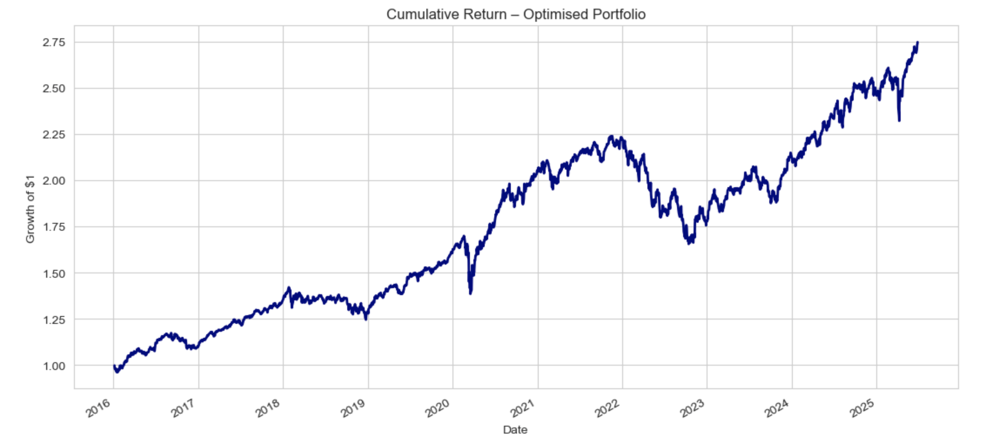
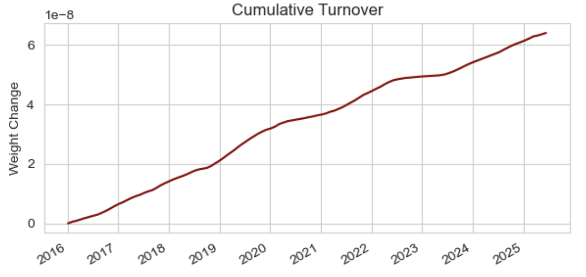

# Asset Allocation Optimizer

A rolling-window portfolio optimization framework combining momentum-based return forecasts and GARCH volatility estimates. Designed for long-only ETF portfolios with optional turnover control.

---

## Methodology

- **Expected Returns**: Based on trailing 12-month momentum
- **Volatility Forecast**: Diagonal GARCH(1,1) per asset
- **Optimization**: Mean-variance portfolio optimization via CVXPY
- **Constraints**:
  - No short positions (weights ≥ 0)
  - Max 30% per asset
  - Fully invested (weights sum to 1)
  - Optional L1 turnover penalty to reduce rebalancing frequency

---

## Files

| File                             | Purpose                                      |
|----------------------------------|----------------------------------------------|
| `asset-allocation-optimizer.py`  | Main backtest script and visualization code  |
| `optimized_portfolio_return.png` | Cumulative return chart                      |
| `rolling_portfolio_weights.png`  | Portfolio weights over time                  |
| `turnover_per_balance.png`       | Turnover at each rebalance                   |
| `cumulative_turnover.png`        | Cumulative turnover across the period        |
| `README.md`                      | Project documentation                        |

---

## Setup

Install required libraries:

```bash
pip install numpy pandas yfinance matplotlib arch cvxpy
```

## Backtest Results (2015–2025)

Annualised Return : 11.45%
Annualised Vol    : 12.31%
Sharpe Ratio      : 0.93

## Plots

📌 Optimized Portfolio Return
<p align="center">  </p>
📌 Rolling Portfolio Weights
<p align="center">  </p>
📌 Turnover Metrics
<p align="center">   </p>

## Notes

The momentum model is simplistic and intended for demonstration purposes.
Replace the expected return with a more advanced forecast (e.g., ML-based signal).
The GARCH estimation is applied independently to each asset for tractability.
Turnover control via L1 penalty helps reduce transaction costs and unrealistic rebalancing.
