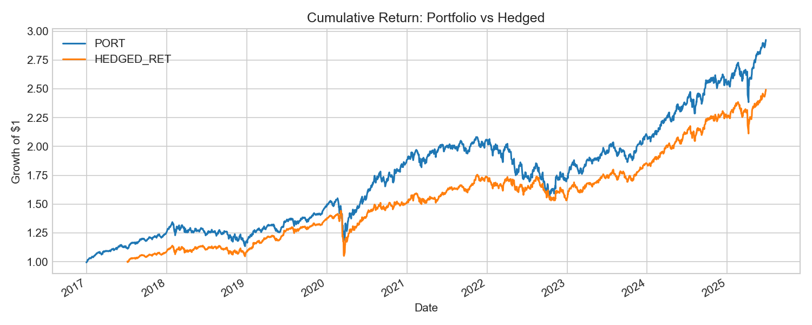
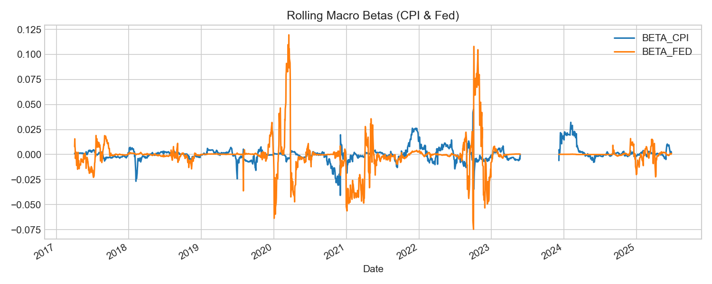
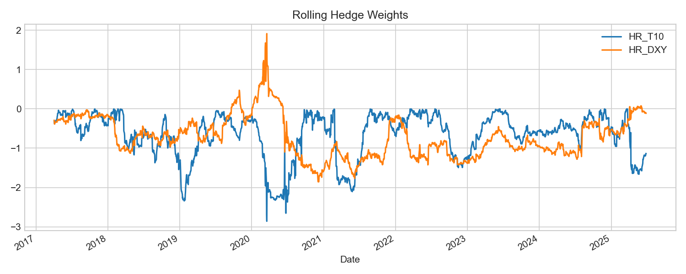
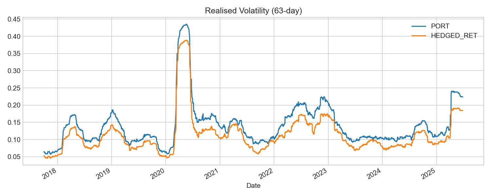
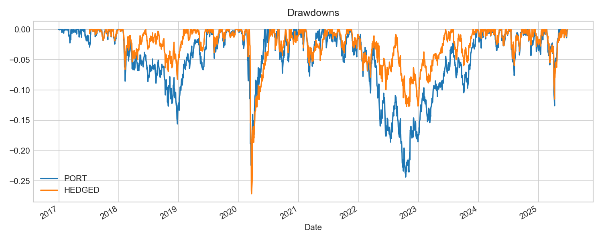

# 🧠 Dynamic Macro Hedge Model

This Python script constructs and evaluates a dynamically hedged macro portfolio using:
- **Inverse-volatility weighted portfolio** of SPY, QQQ, EEM, GLD
- **Macro factor betas** to CPI surprises and Fed Funds shocks
- **Covariance-based hedges** using 10-Year Treasury futures (`ZN=F`) and the Dollar Index (`DXY`)
- **Volatility targeting overlay** to maintain stable portfolio risk

It saves five plots to visualize cumulative return, betas, hedge weights, volatility, and drawdowns.

---

## ⚙️ Methodology

- **Portfolio**: SPY, QQQ, EEM, GLD (inverse-volatility weighted)
- **Macro Factors**: 
  - CPI shocks (z-score of YoY inflation surprise)
  - Fed shocks (clipped 4-day change in Fed Funds)
- **Hedge Assets**: 
  - 10-Year Treasury Futures (`ZN=F`)
  - Dollar Index (`DXY`)
- **Hedging Logic**: Rolling window regression to size hedge weights based on covariance
- **Volatility Overlay**: Scales exposure to keep risk at 80% of original portfolio volatility

---
##  Results
- Dynamic Macro Hedge Results
- Annualised Vol (Original): 14.88%
- Annualised Vol (Hedged) : 12.62%
- Volatility Reduction : 15.2%
  
##  Output Charts
Saved under the `/figures` directory:
- `cum_return.png`: Growth of $1 comparison
- `rolling_macro_betas.png`: Betas to CPI and Fed
- `hedge_weights.png`: T10Y and DXY hedge coefficients
- `realised_vol.png`: Rolling 63-day vol
- `drawdown.png`: Drawdown comparison

  

  

  

  

  

