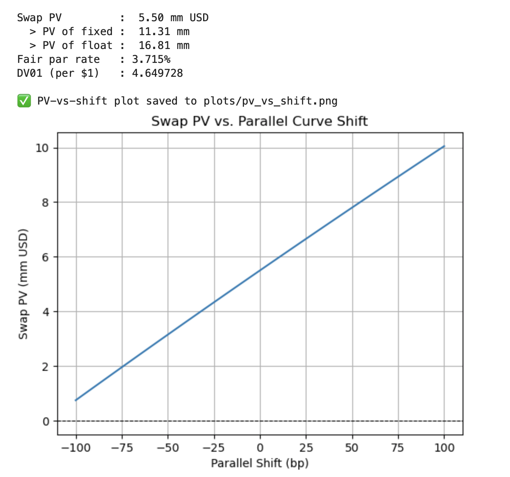

# USD Swap Pricer – Fixed-for-Float Valuation

This project implements a clean and modular **fixed-for-floating interest rate swap pricer** for the USD market, using:

- Bootstrapped discount factors from the latest **FRED par yields**
- Forward rate curve derived from the discount curve
- Cash flow generation for fixed and float legs
- DV01 calculation via bump-and-revalue
- Plot of swap PV under ±100 basis point curve shifts

---

## 🔍 What It Does

- Pulls daily par yield data (1M–30Y) from FRED
- Bootstraps discount factors using semi-annual conventions
- Constructs forward curve from discount factors
- Computes:
  - **Swap PV**
  - **Fair par rate**
  - **DV01 (per $1 notional)**
- Simulates PV changes under ±100 bp **parallel curve shocks**

---

## 📈 Output Example


### 📊 PV vs. Curve Shift Plot



---

## 💻 How to Run

```bash
pip install pandas numpy matplotlib pandas_datareader
python swap_pricer.py
```
