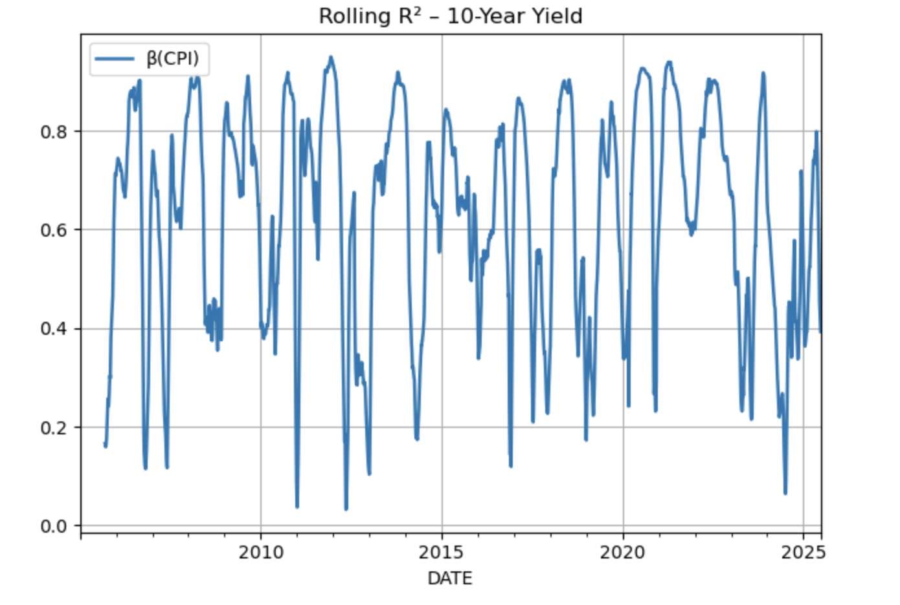
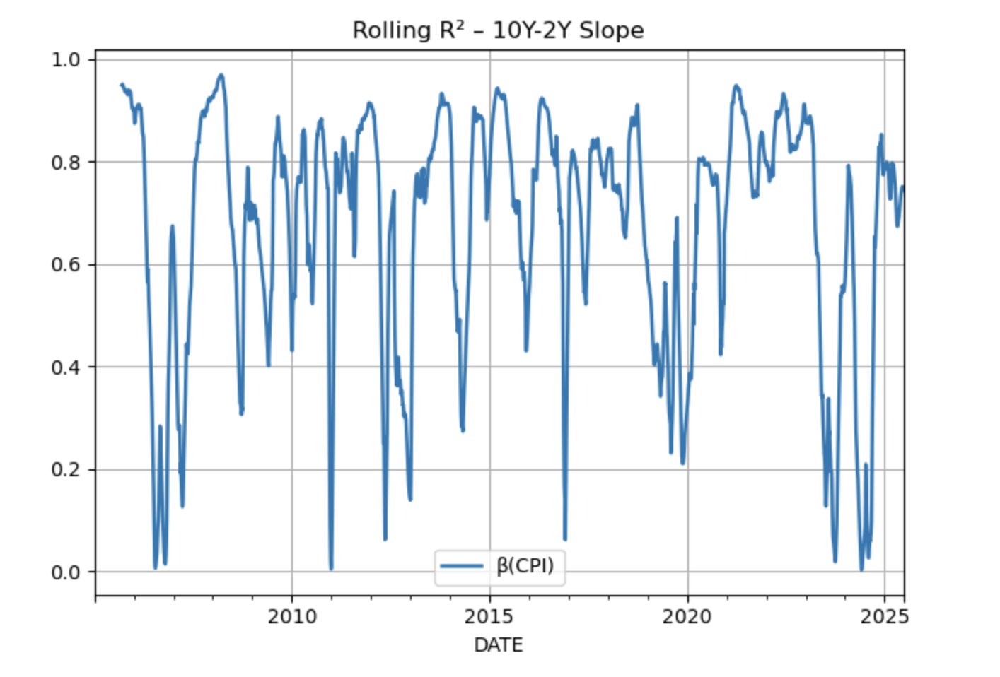
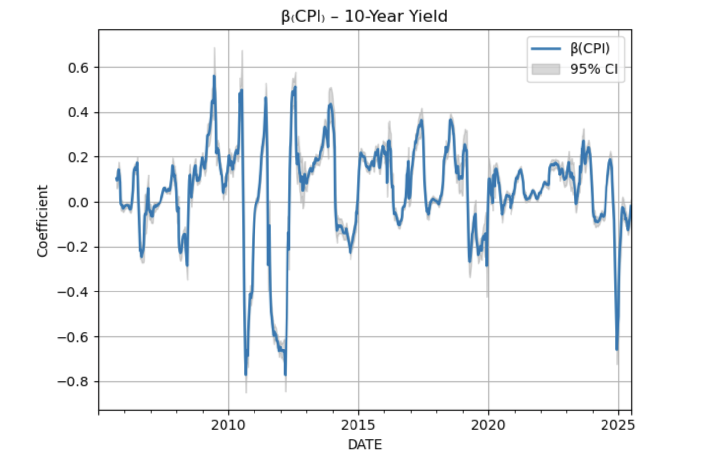
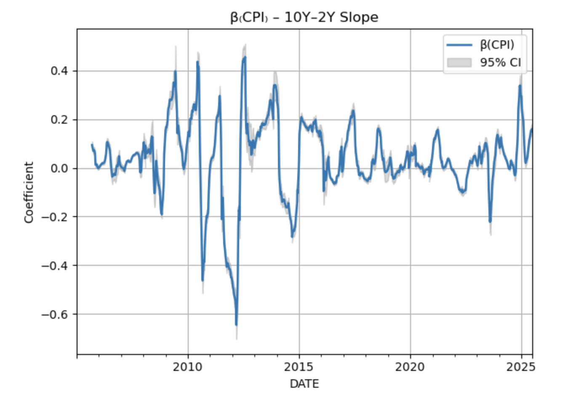

# Macro–Factor Yield-Curve Analyzer

This tool performs a rolling regression analysis to explain movements in US Treasury yields using macroeconomic variables.

## 📈 Overview

- **Targets:**  
  - 10-Year Treasury Yield (`DGS10`)  
  - Yield Curve Slope (`DGS10 - DGS2`)

- **Explanatory Variables:**  
  - Consumer Price Index (CPI)  
  - Unemployment Rate  
  - Federal Funds Rate

- **Method:**  
  - Rolling 252-day Ordinary Least Squares (OLS) regressions
  - Captures time-varying relationships between macro factors and yields

## 🔍 Outputs

- **Rolling R²**: How well macro variables explain each target over time
- **Rolling β(CPI)**: Coefficient on CPI with 95% confidence intervals

##  Sample Plots

### Rolling R²

<p align="center">
  
</p>

<p align="center">
  
</p>

---

### β(CPI) Coefficient

<p align="center">
  
</p>

<p align="center">
  
</p>


## 🛠️ Usage

```bash
pip install pandas numpy statsmodels matplotlib pandas_datareader
python macro_curve_analyzer.py

