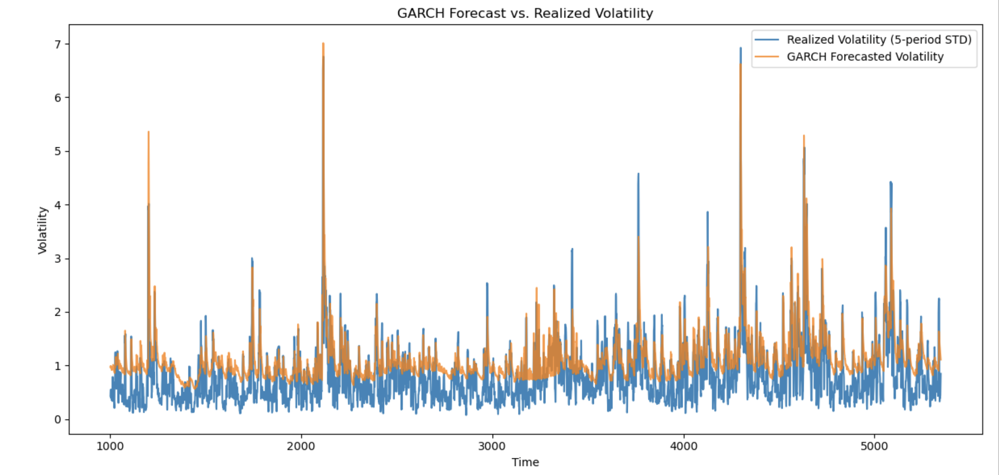
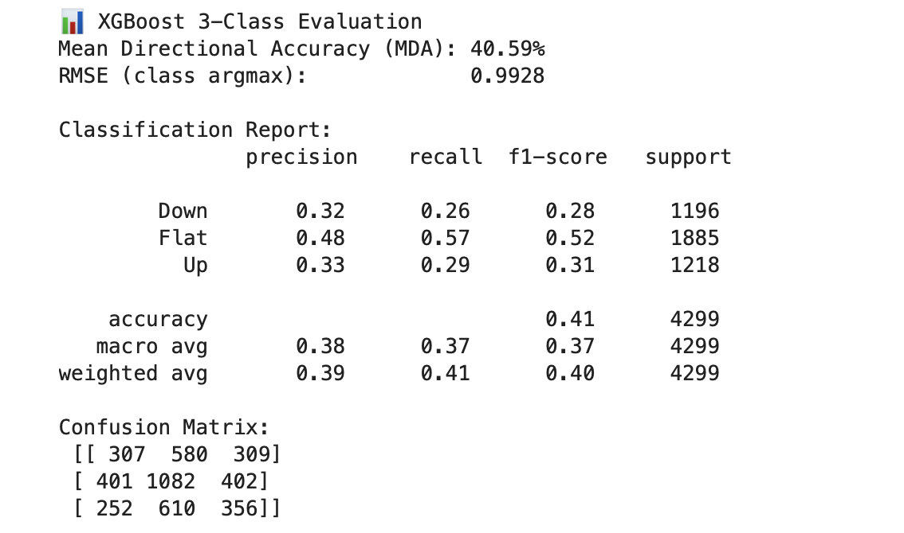

# Execution-Aware Signal Generator (Lasso/XGBoost)

This project demonstrates a rolling-window machine learning pipeline for generating trading signals from financial time series data. It simulates execution-aware long/short positioning using Lasso and XGBoost models.

## Overview

- Fetches historical crypto data (Binance)
- Extracts predictive features including volatility, momentum, GARCH
- Trains models (Lasso or XGBoost) using walk-forward validation
- Generates 3-class directional signals: Down, Flat, Up
- Evaluates predictive accuracy and compares volatility forecasts

---

## 🧠 Feature Engineering

- Realized & GARCH volatility
- Momentum, Z-scores, imbalance
- RSI, MACD, signed volume
- Rolling-window standardization

Implemented in [`feaeture_engineering.py`](feaeture_engineering.py)

---

## 🔍 Volatility Forecast Example

GARCH model fitted to log returns and compared against realized volatility.



---

## 🎯 XGBoost Model Evaluation

Rolling 3-class XGBoost classifier trained on engineered features.



---

## 📁 File Guide

| File | Description |
|------|-------------|
| `fetch_data.py` | Pulls historical Binance futures data |
| `feaeture_engineering.py` | Constructs predictive features for ML |
| `xgboost_signal_generator.py` | Builds rolling XGBoost model and generates signals |
| `model_evaluation.png` | Evaluation screenshot for 3-class classifier |
| `garch_plot.png` | Volatility forecast vs realized vol plot |

---

## ▶️ How to Run

```bash
python fetch_data.py
python feauture_engineering.py
python xgboost_signal_generator.py
```

## 🔧 Dependencies

- Python 3.9+
- pandas
- numpy
- matplotlib
- scikit-learn
- xgboost
- arch
- python-binance

## 🧪 Backtesting

`custom_backtester.py` implements a minimal yet precise backtest engine with:

- Stop-loss / take-profit triggers
- Position-based equity tracking
- Strategy PnL and risk metrics (e.g. Sharpe, Max Drawdown)

It can be run standalone or plugged into signal outputs from `xgboost_signal_generator.py`.


## 📌 Notes

- Rolling-window logic avoids lookahead bias
- Feature engineering is modular — extendable for new signals
- GARCH fitting can be slow; consider reducing rolling window for faster runs
- Backtest logic not included here — can be added using `backtrader`, `bt`, or custom code
