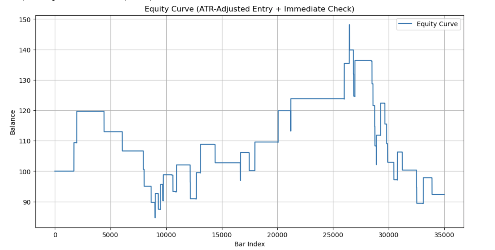

# Execution-Aware Signal Generator (Lasso/XGBoost)

This project demonstrates a rolling-window machine learning pipeline for generating trading signals from financial time series data. It simulates execution-aware long/short positioning using Lasso and XGBoost models.

## Overview

- Fetches historical crypto data (Binance)
- Extracts predictive features including volatility, momentum, GARCH
- Trains models (Lasso or XGBoost) using walk-forward validation
- Generates 3-class directional signals: Down, Flat, Up
- Evaluates predictive accuracy and compares volatility forecasts

---

## 🧠 Feature Engineering

- Realized & GARCH volatility
- Momentum, Z-scores, imbalance
- RSI, MACD, signed volume
- Rolling-window standardization

Implemented in [`feaeture_engineering.py`](feaeture_engineering.py)

---

## 🔍 Volatility Forecast Example

GARCH model fitted to log returns and compared against realized volatility.


---

## 🎯 XGBoost Model Evaluation

Rolling 3-class XGBoost classifier trained on engineered features.


---

## 📁 File Guide

| File | Description |
|------|-------------|
| `fetch_data.py` | Pulls historical Binance futures data |
| `feature_engineering.py` | Constructs predictive features for ML |
| `xgboost_signal_generator.py` | Builds rolling XGBoost model and generates signals |
| `backtest.py` | Custom backtester with execution-aware logic |
| `sync_dfs.py` | Maps higher-TF (2h) signals to lower-TF (1m) execution bars |
| `validate_sync.py` | Random sample-based validation of sync integrity |
| `model_evaluation.png` | Evaluation screenshot for 3-class classifier |
| `garch_plot.png` | Volatility forecast vs realized vol plot |
| `equity_curve.png` | Equity curve after backtest execution |

---

## ▶️ How to Run

```bash
python fetch_data.py
python feauture_engineering.py
python xgboost_signal_generator.py
```

## 🔧 Dependencies

- Python 3.9+
- pandas
- numpy
- matplotlib
- scikit-learn
- xgboost
- arch
- python-binance

## Backtester

This project includes a custom backtester (`backtester.py`) that simulates realistic execution logic for long/short strategies. Key features include:

- ATR or volatility-based entry filtering
- Dynamic stop-loss / take-profit
- Randomized resolution of ambiguous bars (when both stop and target are hit)
- Maker fees and leverage impact
- Metrics: win rate, drawdown, PnL, ambiguity

## 📈 Example Output



> ⚠️ **Note**: This equity curve reflects baseline performance using ATR-adjusted entries without volatility regime filtering. While the model captures directional momentum in certain regions, overall performance suffers during high-noise, low-volatility periods. Future improvements will incorporate GARCH-based volatility filters and trend-adaptive logic to reduce drawdown and improve Sharpe ratio.

## 🧪 Usage

```bash
# Install dependencies
pip install -r requirements.txt

# Run backtest on sample data
python backtest.py
```

## 🔄 Multi-Timeframe Signal Sync

This project supports 2h-to-1m reconciliation to evaluate how higher-timeframe signals behave in lower-timeframe execution environments.

Key scripts:
- `sync_dfs.py`: Attaches each 2h signal to the next available 1m bar (by `Close_time`)
- `validate_sync.py`: Samples matched signals for manual inspection and validation

This enables granular testing of signal behavior under 1m volatility, slippage, and ambiguity conditions — essential for realistic PnL evaluation and trade timing.


## 📌 Notes

- Rolling-window logic avoids lookahead bias
- Feature engineering is modular — extendable for new signals
- GARCH fitting can be slow; consider reducing rolling window for faster runs

