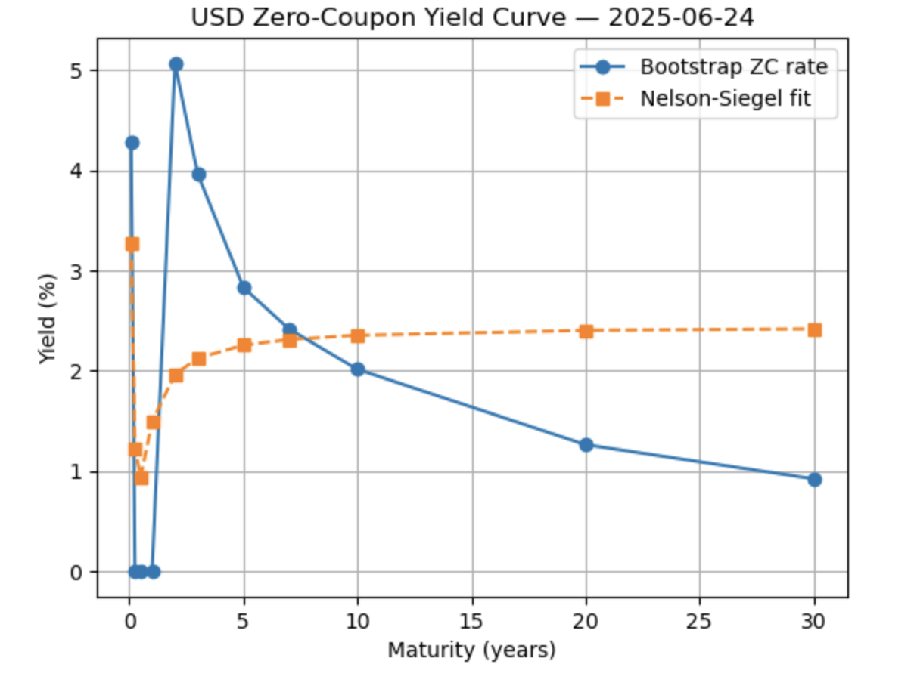
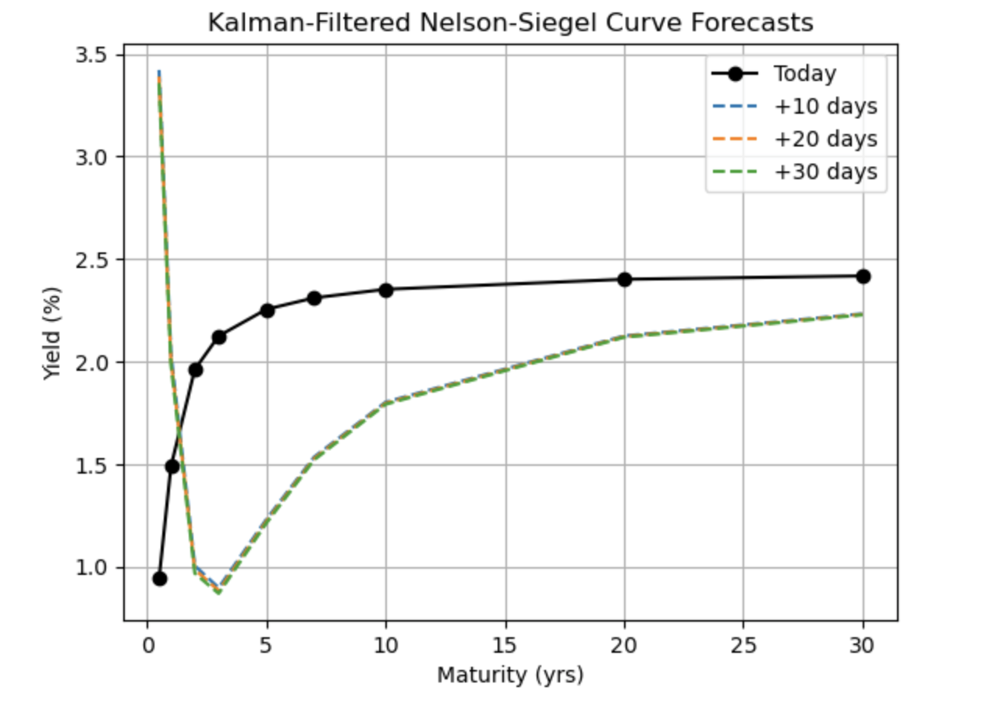

# Yield Curve Construction & Nelson-Siegel Fit

This project constructs a zero-coupon USD yield curve from Treasury par yields and fits a **Nelson-Siegel** model to estimate the term structure of interest rates.

##  What It Does

- Downloads par yields (1M–30Y) from the **FRED** database
- Bootstraps **zero-coupon discount factors** and rates
- Fits the **Nelson-Siegel** model using nonlinear least squares
- Plots the raw vs. fitted term structure and saves it


## 📈 Today's Yield Curve

<p align="center">
  
</p>

## 🔮 Kalman Forecast (30-Day Horizon)

<p align="center">
  
</p>

##  Getting Started

```bash
git clone https://github.com/<your-handle>/yield-curve-model.git
cd yield-curve-model
pip install -r requirements.txt
python yield_curve.py
```


